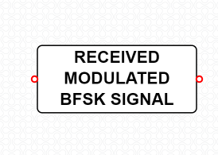
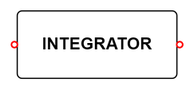
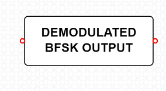

#### **Introduction**
In this digital modulation scheme, for every relative change in input signal, frequency varied output is
obtained. Here, the binary input signal shifts the center frequency of the high frequency signal to
fc+del(f) or fc-del(f) based on the corresponding change in input data. The FSK output signal produces
deviation of fc+del(f) when mark signal ( logic 1) is given as input and it produces fc-del(f) when space
signal ( logic 0) is given as input. The developed graphical user interface permits users to visualize both
input and output frequencies.

#### Equations/formulas:

| **Theory**     | **Formulae** |   **Description**|
| :-----------: | :------------: | :-----------: |
|Bit Error Rate (BER) Calculation for BFSK:     | Pe=(1/2)erfc(sqrt(Eb/N0))  |   Pe🡪 Probability of error, erfc🡪 Complimentary error function ,Eb🡪 Energy per bit, N0🡪 Noise Spectral Density|

#### Functional blocks for BFSK Modulation and Demodulation
#### **1. Transmiter Section:**

#### **Binary Data Sequence:**

This is the input blocks of the transmitter component, where bit sequence is solemnly used for message signal generation dedicated for carrier wave generation as depicted below.

#### **ON OFF Level Encoder:**

ON-OFF Keying (OOK) is most commonly used to transmit Morse code over radio frequencies (referred to as continuous wave operation), although in principle any digital encoding scheme may be used. OOK has been used in the ISM bands to transfer data between computers.

#### **Product Modulator:**

 The modulated output is substantially equal to the carrier and the modulating wave; the term implies a device in which intermodulation between components of the modulating wave does not occur. This block is as depicted below.

#### **Adder :**

Adder is used to add the signals from both the product modulators.

#### **Inverter :**

A digital inverter is a basic building block of many binary devices. It simply takes a zero or one as input and returns a one or zero, respectively, as output.

#### **Modulated BFSK Output :**

The modulated BFSK output block gives us the modulated output of the BFSK signal. The output block is as depicted below.

#### **2. Receiver Section:**

#### **Received Modulated BFSK Signal :**
 Received modulated BFSK signal is a device for reception of radio frequency (RF). A receiving antenna performs the reverse of the process performed by the transmission antenna. It receives radiofrequency radiation or in this case the transmitted signal .This process is depicted below.

#### **Integrator :**
An integrator in measurement and control applications is an element whose output signal is the time integral of its input signal. It accumulates the input quantity over a defined time to produce a representative output

#### **Decision device :**
The timing circuit determines the sampling times. The decision device is enabled at these sampling times. The decision device decides its output based on whether the amplitude of the quantized pulse and the noise, exceeds a pre-determined value or not.

#### **Demodulated BFSK Output :**
 The demodulated BFSK output block gives us the demodulated output of the BFSK signal. The output block is as depicted below.

