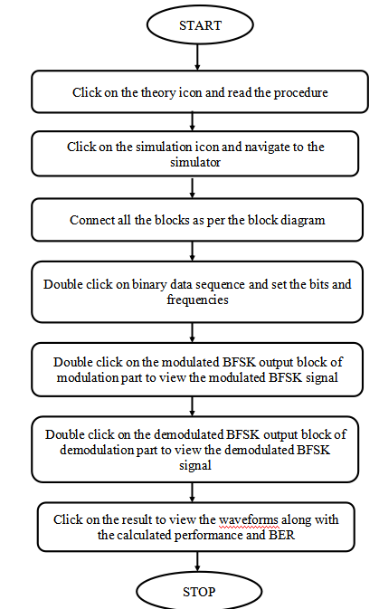

#### Proposal ID : **NITK_PALS_22_017_01**

#### Experiment Name : **Binary Frequency Shift Keying (BFSK)**

#### **Story Outline:**
Experiment focuses on understanding the principle of Binary Frequency Shift Keying (BFSK). This experiment is formulated to show the modulation and demodulation of the same technique through different digital inputs and frequencies. Further, the modulated signal can be viewed in time and frequency domain and bit error rate can be estimated

#### **Story:**

 The simulator workspace includes blocks such as binary data sequence for providing the binary data as the input, on-off level encoder for level shifting. Here the binary 1 is level shifted to   and binary 0 is maintained at same level. The inverter is used to make sure that frequency f1 is transmitted when symbol 1 is given as input. When symbol 0 is transmitted upper channel is turned OFF and lower channel is turned ON. The multiplier multiplies the corresponding signal and given to adder to get modulated signal. The demodulator section consists of multiplier, integrator and decision device where the received BFSK modulated signal is demodulated to get the estimated Binary output. Estimation of Bit error rate calculation is done based on the extracted parameter.

#### **Set User Objectives & Goals:**

1) State the principle of BFSK modulation and demodulation
2) Recall the operation theory of Binary frequency shift keying.
3) Analyze modulation and demodulation of BFSK technique through an AWGN channel
4) Analyze the performance of BFSK system by varying the frequencies of input signal.
5) Explore the use of Costas Loop in demodulating the BFSK signal and evaluate the BER.

#### **Pathway activities:**

1) Click on the theory icon to browse through the theory and procedure for simulating Binary Frequency Shift Keying.
2) Connect the blocks as per the block diagram in theory. This is done by clicking the connection points in the correct order.
3) The input bits and corresponding frequencies are set by clicking Binary data sequence block.
4) The modulated output is observed on clicking the modulated BFSK output block.

5) In the demodulator, the integrator and comparator are used to get the received modulated signal to produce the modulating signal.
6) Verify the modulator and demodulator circuit in the workspace as per the procedure to record and analyze the signal at transmitter and receiver.
7) Calculate bit error rate and efficiency parameters for the proposed circuit.**

#### **Set Challenges and Questions/Complexity/variation**
### **Pre Test Section :**

#### **Note**:
These questions are asked to examine the Theoretical knowledge absorbed by the user  during the theory class.
Please do answer all the questions below within the allocated time to avoid any errors.

##### Number of Questions:5
##### Question Pattern: MCQ

#### **Quick Quiz**
##### 1.	The bandwidth of BFSK is ______ than BPSK.
 A.	Lower

 ***B.	Higher***

 C.	Same

##### 2.	FSK reception uses  
 ***A.	Correlation receiver & PLL***

 B.	PLL

 C.	Correlation receiver

 D.	 None

##### 3.	In BFSK mark and space represent
 A.	0

***B. 1 and 0***

 C.	1

#####  4.	For generation of FSK, data patter will be 
***A.	NRZ***

 B.	RZ

 C.Split-phase

##### 5.	The frequency shifts in BFSK usually lies in the range
 A.	200 to 500Hz

 ***B.	50 to 1000Hz***

 C.	500 to 10KHz

 D.	100 to 2000Hz

### **Post Test Section**
#### **Note**:
These questions are asked to check the knowledge attained by the user after performing the experiment.
Please do answer all the questions below within the allocated time to avoid any errors.

##### Number of Questions:5
##### Question Pattern: MCQ

#### **Quick Quiz**

##### 1. The spectrum of BFSK may be viewed as the sum of
 ***A.	Two ASK spectra***

 B.	Two PSK spectra

 C.	Two FSK spectra

 D.	None of the Above

##### 2. The maximum bandwidth is occupied by
 A.	ASK

B.	BPSK

***C.	FSK***

 D.	None

##### 3. Frequency shift keying is used mostly in
 A.	Radio

 ***B.	Telegraphy***

 C.	Telephony

 D.	Television

##### 4. Which FSK has no phase discontinuity?
 ***A. Continuous FSK***

 B.Discrete FSK

 C.Uniform FSK

D. None of the mentioned

##### 5.  In Coherent demodulation technique of FSK signal can be affected using?
 ***A.    Correlation receiver***

B.     Bandpass filters and envelope detector

C.     Matched filter

 D.      Discriminator detection

#### **Conclusion:**

The approximate time required to understand the procedure to perform the experiment would take about 5 min. To connect all the different blocks and to set the input parameter for modulation & demodulation will take another 7 min. Analyzing the output with theory calculations will take 5 min. Answering the assessment questions will take about 5 min. Thus, the total time required to perform the experiment will require around 22 min.

#### **Equations/formulas:**

| **Theory**     | **Formulae** |   **Description**|
| :-----------: | :------------: | :-----------: |
|**Bit Error Rate (BER) Calculation for BFSK:**     | **Pe=(1/2)erfc(sqrt(Eb/N0))**  |   **Pe🡪 Probability of error, erfc🡪 Complimentary error function ,Eb🡪 Energy per bit, N0🡪 Noise Spectral Density**|

#### Flowchart:

#### Mindmap:

## **Storyboard:**

### ***Transmiter side:***
**Binary Data Sequence:**
This is the input blocks of the transmitter component, where bit sequence is solemnly used for message signal generation dedicated for carrier wave generation as depicted below.

**ON OFF Level Encoder:**
ON-OFF Keying (OOK) is most commonly used to transmit Morse code over radio frequencies (referred to as continuous wave operation), although in principle any digital encoding scheme may be used. OOK has been used in the ISM bands to transfer data between computers.

**Product Modulator:**
The modulated output is substantially equal to the carrier and the modulating wave; the term implies a device in which intermodulation between components of the modulating wave does not occur. This block is as depicted below. 

**Adder :**
 Adder is used to add the signals from both the product modulators. 

**Inverter :**
A digital inverter is a basic building block of many binary devices. It simply takes a zero or one as input and returns a one or zero, respectively, as output. 

**Modulated BFSK Output :**
 The modulated BFSK output block gives us the modulated output of the BFSK signal. The output block is as depicted below.

### ***Receiver side:***

**Received Modulated BFSK Signal :**
 Received modulated BFSK signal is a device for reception of radio frequency (RF). A receiving antenna performs the reverse of the process performed by the transmission antenna. It receives radiofrequency radiation or in this case the transmitted signal .This process is depicted below. 

**Integrator :**
An integrator in measurement and control applications is an element whose output signal is the time integral of its input signal. It accumulates the input quantity over a defined time to produce a representative output

**Decision device :**
 The timing circuit determines the sampling times. The decision device is enabled at these sampling times. The decision device decides its output based on whether the amplitude of the quantized pulse and the noise, exceeds a pre-determined value or not.

**Demodulated BFSK Output :**
The demodulated BFSK output block gives us the demodulated output of the BFSK signal. The output block is as depicted below.

### **Procedure:**

#### **Step by Step Procedure to perform experiment**

##### **A)BFSK Modulation**

 **Step1:** The user should click on the theory under which the concept behind the working of the experiment would be displayed followed by the procedure which would be displayed in the screen, so that the user could perform the BFSK modulation and demodulation experiment based on the guidelines listed under the procedure.

 **Step2**:The blocks required for the experiment is displayed. The user should connect the blocks as per the block diagram in the theory.

 **Step3:** Once the user performs Step 2, then the user could very well double click on the binary data sequence block, so that the user could set the digital bits, frequency, horizontal and vertical scales to get the required graph.

 **Step4:** Once the user performs Step 3, then the user can double click on the modulated BFSK output block to view the modulated BFSK graph.

 **Step5:**  Once the user performs Step 4, then the user has successfully performed the BFSK Modulation and the below figure depicts the workspace to perform the experiment of BFSK Modulation.

##### Sample wiring layout for connecting the various blocks:

To remove a particular wire or undo a wire, select the wire first, the wire gets highlighted and now click on delete button.

The reset button is available at the top right corner of the simulation, so that it clears all the existing connections.

#### Quiz

Quiz dialog box appears once we finish our connections for both modulation and demodulation.

After completing the quiz, click on submit button.

Correct answers are highlighted in green colour and wrong answers are highlighted in red colour.

##### Sample Input for the  binary data sequence :

##### Sample graph for the  phi1(t) :

##### Sample graph for the  phi2(t) :

##### Sample output :

##### **B)BFSK Demodulation**

**Step1:** Once the user performs the BFSK Modulation, then the user would be redirected below where the user would see the BFSK Demodulation /Receiver.

**Step2:** Once the user performs Step 1, then the user could then see the demodulation part of BFSK experiment to carry out the demodulation by connecting the required blocks.

  **Step3:** Once the user performs Step 2, then the user could simulate the BFSK demodulation i.e. click on the demodulated BFSK output. Once the Compilation of the design model is completed then the output process i.e., the extraction of the modulated signal from the modulating signal. Would be performed and the output which is the modulated signal (message signal).

  **Step4:** Once the user performs Step 3, then the user has successfully performed the BFSK Demodulation. Figure-16 depicts the workspace to perform the experiment of BFSK Demodulation.

##### Sample wiring layout for connecting the various blocks:

##### **Sample output waveform depicting the process of  BFSK Demodulation:**

