#### **Step by Step Procedure to perform experiment**

##### **A)QPSK Modulation**

**Step1:** The user should click on the theory under which the concept behind the working of the experiment would be displayed followed by the procedure which would be displayed in the screen, so that the user could perform the QPSK modulation and demodulation experiment based on the guidelines listed under the procedure.

**Step2**:The blocks required for the experiment is displayed. The user should connect the blocks as per the block diagram in the theory

**Step3:** Once the user performs Step 2, then the user could very well double click on the binary data sequence block, so that the user could set the digital bits, frequency, horizontal and vertical scales to get the required graph.

**Step4:** Once the user performs Step 3, then the user can double click on the modulated QPSK output block to view the modulated QPSK graph.

**Step5:**  Once the user performs Step 4, then the user has successfully performed the QPSK Modulation and the below Figure depicts the workspace to perform the experiment of QPSK Modulation.

##### Sample wiring layout for connecting the various blocks:

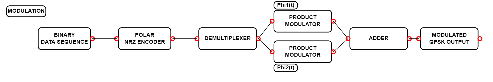

To remove a particular wire or undo a wire, select the wire first, the wire gets highlighted and now click on delete button.

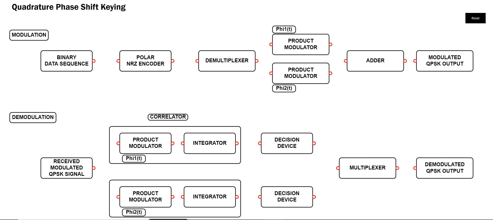

The reset button is available at the top right corner of the simulation, so that it clears all the existing connections.

#### Quiz

Quiz dialog box appears once we finish our connections for both modulation and demodulation.

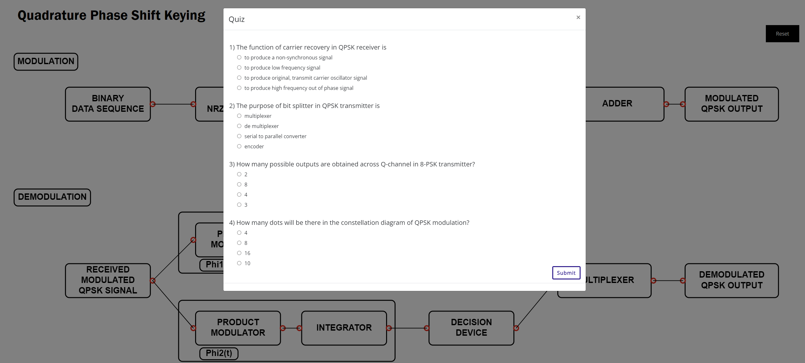

After completing the quiz, click on submit button.

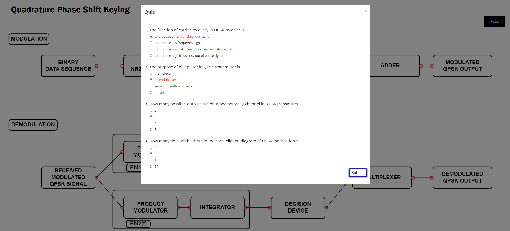

Correct answers are highlighted in green colour and wrong answers are highlighted in red colour.

##### Sample Input for the  binary data sequence :

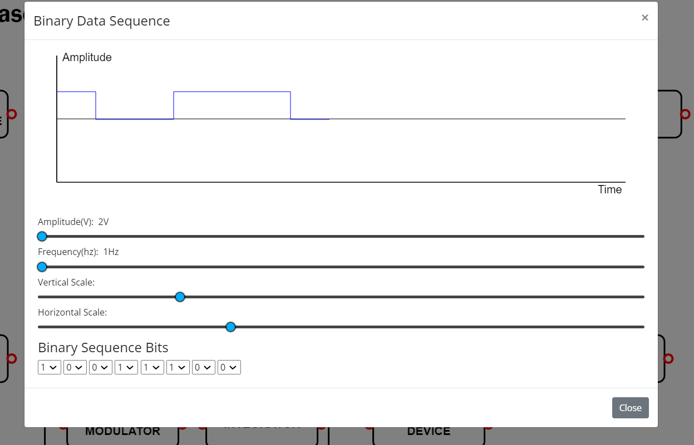

##### Sample graph for the  polar nrz signal :

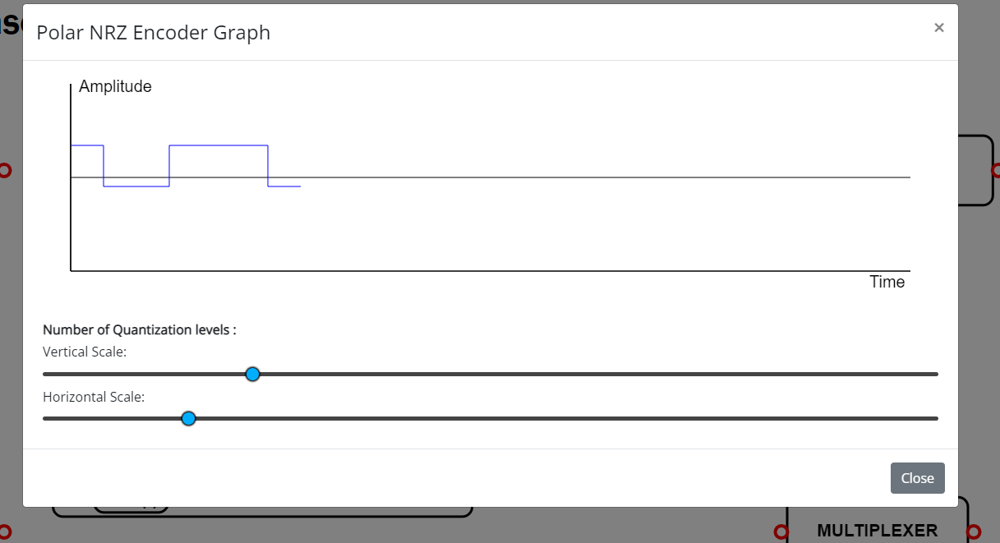

##### Sample graph for the  phi1(t) :

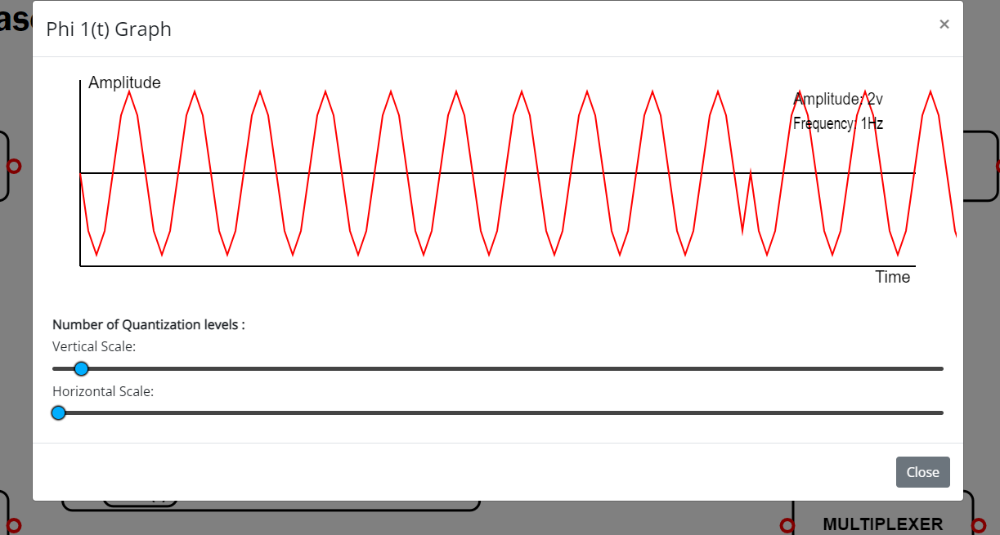

##### Sample graph for the  phi2(t) :

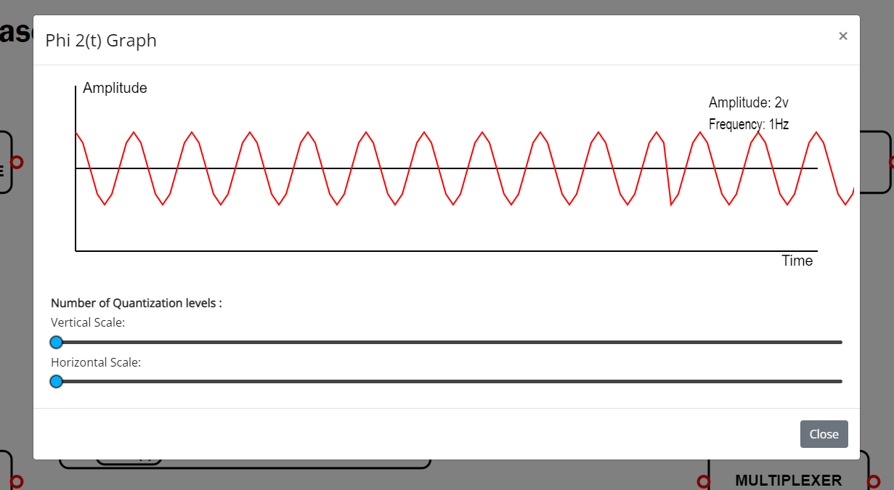

##### Sample graph for the  Adder :

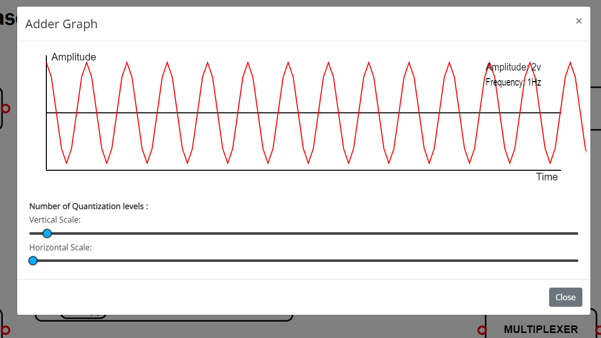

##### Sample output :

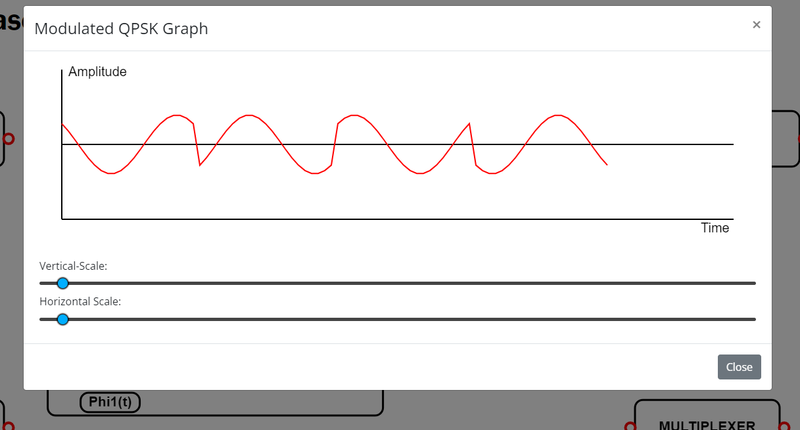

##### **B)QPSK Demodulation**

**Step1:** Once the user performs the QPSK Modulation,then the user would be redirected below where the user would see the QPSK Demodulation /Receiver

**Step2:** Once the user performs Step 1, then the user could then see the demodulation part of QPSK experiment to carry out the demodulation by connecting the required blocks

**Step3:** Once the user performs Step 2, then the user could simulate the QPSK demodulation i.e. click on the demodulated QPSK output. Once the Compilation of the design model is completed then the output process i.e., the extraction of the modulated signal from the modulating signal. Would be performed and the output which is the modulated signal.

**Step4:** Once the user performs Step 3, then the user has successfully performed the QPSK Demodulation. Figure-17depicts the workspace to perform the experiment of QPSK Demodulation.

##### Sample wiring layout for connecting the various blocks:

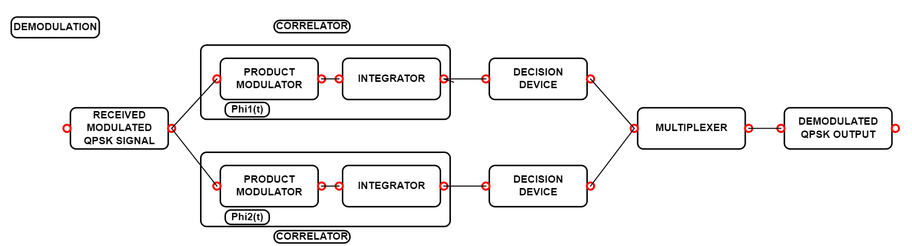

##### Sample output waveform depicting the process of  Received QPSK Demodulation:

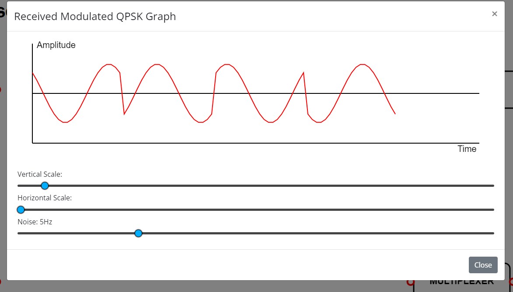

##### Sample output waveform depicting the process of  QPSK Demodulation:

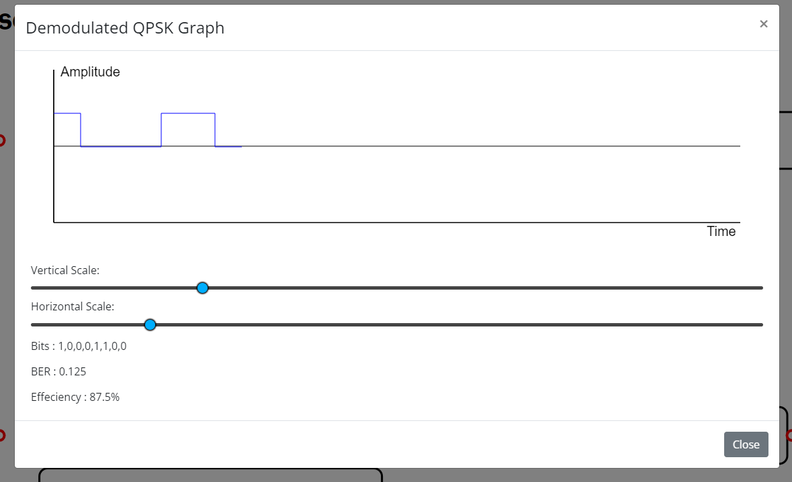
