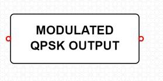
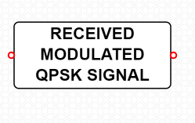
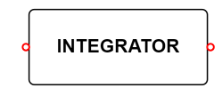
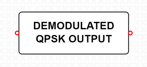

#### **Introduction**

QPSK modulation technique is evolved by combining BPSK and Double Side Band Suppressed Carrier(
DSBSC) modulation scheme . It involves modulation of two bits with one among four carrier phase
angles (0, 90, 180, or 270 degrees) at same time instance. It is one type of PSK which permits a signal to
transmit twice as much data in the same allotted bandwidth. The key benefit in this scheme is
transforming digital bits into bit pairs rather than bit streams. This further reduces bit rate of the input
data to one-half which facilitates allocation of bandwidth for more end users.

#### Equations/formulas:

|                 **Theory**                 |       **Formulae**        |                                               **Description**                                                |
| :----------------------------------------: | :-----------------------: | :----------------------------------------------------------------------------------------------------------: |
| Bit Error Rate (BER) Calculation for QPSK: | Pe=(1/2)erfc(sqrt(Eb/N0)) | Pe🡪 Probability of error, erfc🡪 Complimentary error function ,Eb🡪 Energy per bit, N0🡪 Noise Spectral Density |

#### **Functional blocks for QPSK Modulation and Demodulation**

##### **Transmitter side:**

**Binary Data Sequence:**

This is the input blocks of the transmitter component, where bit sequence is solemnly used for message signal generation dedicated for carrier wave generation as depicted below.

**Polar NRZ Encoder:**

In this type of Polar signaling, a High in data is represented by a positive pulse, while a Low in data is represented by a negative pulse.

**Demultiplexer:**

A demultiplexer (also known as a demux or data distributor) is defined as a circuit that can distribute or deliver multiple outputs from a single input. The function of a demultiplexer circuit essentially the reverse of the multiplexer

**Product Modulator:**

The modulated output is substantially equal to the carrier and the modulating wave; the term implies a device in which intermodulation between components of the modulating wave does not occur. This block is as depicted below.

**Adder :**

Adder is used to add the signals from both the product modulators.

**Modulated QPSK Output :**

The modulated QPSK output block gives us the modulated output of the QPSK signal. The output block is as depicted below.

##### **Receiver side:**

**Received Modulated QPSK Signal :**

Received modulated QPSK signal is a device for reception of radiofrequency (RF) signal. A receiving antenna performs the reverse of the process performed by the transmission antenna. It receives radiofrequency radiation or in this case the transmitted signal .This process is depicted below.

**Integrator :**

An integrator in measurement and control applications is an element whose output signal is the time integral of its input signal. It accumulates the input quantity over a defined time to produce a representative output

**Decision device :**

The timing circuit determines the sampling times. The decision device is enabled at these sampling times. The decision device decides its output based on whether the amplitude of the quantized pulse and the noise, exceeds a pre-determined value or not.

**Multiplexer :**

MUX is a device that selects between several analog or digital input signals and forwards the selected input to a single output line. The selection is directed by a separate set of digital inputs known as select lines

**Demodulated QPSK Output :**

The demodulated QPSK output block gives us the demodulated output of the QPSK signal. The output block is as depicted below.

