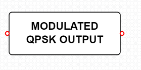

### Proposal ID : NITK_PALS_22_017_06

#### Experiment Name : **QPSK Modulation and Demodulation**

#### Story Outline:
 This experiment focuses on understanding the principle of QPSK modulation & demodulation. This experiment is formulated to show the modulation and demodulation of the same technique through different digital inputs. Further, the modulated signal can be viewed intime and frequency domain and bit error rate can be estimated.

#### Story:

 The simulator workspace includes blocks such as binary data sequence, polar NRZ encoder, product modulator & integrator (as correlator), adder, decision device, Multiplexer &Demultiplexer, Received QPSK modulated signal, Modulated & Demodulated QPSK Output. The position of the blocks are static and wires are to be connected by the user as per the block diagram.

#### Set User Objectives & Goals:

 1) State the principle of QPSK modulation and demodulation

 2) Recall the operation theory of Quadrature phase shift keying.

 3) Analyze modulation and demodulation of QPSK technique through an AWGN channel.

 4) Analyze the performance of QPSK system by varying the bits of input signal.

 5) To explore the use of Costas Loop in demodulating the QPSK signal and calculate BER.

#### Pathway activities:

 1) Students will navigate to the theory icon and click on it to browse through the theory and procedure, which will direct them through the process of simulating QPSK modulation and demodulation.

 2) The user should next connect the blocks as per the block diagram in theory

 3) Click on the binary data sequence block and set the input bits of the input signal.

 4) Click on the modulated QPSK output block to view the modulated output

 5) In the demodulator, the integrator and decision device are used to get the received modulated signal to produce the modulating signal.

 6) Verify the modulator and demodulator circuit in the workspace as per the procedure to record and analyze the signal at transmitter and receiver.

 7) Calculate bit error rate and efficiency parameters for the circuit.

#### Set Challenges and Questions/Complexity/variation

**Pre Test Section :**

**Note:**

These questions are asked to examine the Theoretical knowledge absorbed by the user  during the theory class.

Please do answer all the questions below within the allocated time to avoid any errors.

###### Number of Questions:5
###### Question Pattern: MCQ

#### Quick Quiz

#### 1.How many number of symbols are used in QPSK?
 
 A. 4 bits
 
 **B.   2 bits**
 
 C. 1 bit

#### 2.  Data rate of Quadrature Phase Shift Keying is ___________ of BPSK.
 
 **A.   Twice**
 
 B. Thrice
 
 C. Same
 
 D.  Four Time

#### 3.  A phase shift of ___________ is used in QPSK system.
 
 A. Pi
 
 **B. Pi/2**
 
 C. Pi/4

#### 4.  QPSK carrier is modulated by a digital sequences having one of the phases of 0,90,180,270o?
 
 **A.   True**
 
 B. False

#### 5.  Pick the number of outputs from a 8-PSK transmitter.
 
 A. 2
 
 **B.   8**
 
 C. 4
 
 D. 3

#### Post Test Section

**Note:**

These questions are asked to check the knowledge attained by the user after performing the experiment.

Please do answer all the questions below within the allocated time to avoid any errors.

##### Number of Questions:5
###### Question Pattern: MCQ

#### Quick Quiz

#### 1.Choose the function of carrier recovery block in QPSK receiver is
 
 A. to produce a non-synchronous signal
 
 B. to produce low frequency signal
 
 **C.   to produce original, transmit carrier oscillator signal**
 
 D. to produce high frequency out of phase signal
 
#### 2. Bit splitter in QPSK transmitter acts as
 
 A. multiplexer
 
 **B.   serial to parallel converter**
 
 C. encoder
 
 D. parallel to serial converter
 
#### 3.The number of outputs across Q-channel in 8-PSK transmitter is
 
 A. 2
 
 B. 8
 
 **C. 4**
 
 D. 6
 
#### 4. Pick the number of dots in the constellation diagram of QPSK modulation.
 
 **A. 4**
 
 B. 8
 
 C. 16
 
 D. 12

#### 5. The bandwidth efficiency is also called as
 
 **A.    information density**
 
  B.    transmission efficiency
 
 C.      spectral density
 
  D.      minimum bandwidth

#### Conclusion:

By doing the above experiment we would get familiarized with the concept of quadrature phase shift keying modulation and demodulation. The approximate time required to understand the procedure to perform the experiment would take about 5 min. To connect all the different blocks and to set the input parameter for modulation & demodulation will take another 7 min. Analyzing the output with theory calculations will take 5 min. Answering the assessment questions will take about 5 min. Thus, the total time required to perform the experiment will require around 22 min.

#### Equations/formulas:

| Theory     | Formulae |   Description|
| :-----------: | :------------: | :-----------: |
|Bit Error Rate (BER) Calculation for QPSK:     | Pe=(1/2)erfc(sqrt(Eb/N0))  |   Pe🡪 Probability of error, erfc🡪 Complimentary error function ,Eb🡪 Energy per bit, N0🡪 Noise Spectral Density|

#### Flowchart:

#### Mindmap:

## Storyboard:

##### **Transmitter side:**

**Binary Data Sequence:**

This is the input blocks of the transmitter component, where bit sequence is solemnly used for message signal generation dedicated for carrier wave generation as depicted below.

**Polar NRZ Encoder:**

In this type of Polar signaling, a High in data is represented by a positive pulse, while a Low in data is represented by a negative pulse.

**Demultiplexer:**

A demultiplexer (also known as a demux or data distributor) is defined as a circuit that can distribute or deliver multiple outputs from a single input. The function of a demultiplexer circuit essentially the reverse of the multiplexer

**Product Modulator:**

The modulated output is substantially equal to the carrier and the modulating wave; the term implies a device in which intermodulation between components of the modulating wave does not occur. This block is as depicted below.

**Adder :**

Adder is used to add the signals from both the product modulators.

**Modulated QPSK Output :**

The modulated QPSK output block gives us the modulated output of the QPSK signal. The output block is as depicted below.

##### **Receiver side:**

**Received Modulated QPSK Signal :**

Received modulated QPSK signal is a device for reception of radiofrequency (RF) signal. A receiving antenna performs the reverse of the process performed by the transmission antenna. It receives radiofrequency radiation or in this case the transmitted signal .This process is depicted below.

**Integrator :**

An integrator in measurement and control applications is an element whose output signal is the time integral of its input signal. It accumulates the input quantity over a defined time to produce a representative output

**Decision device :**

The timing circuit determines the sampling times. The decision device is enabled at these sampling times. The decision device decides its output based on whether the amplitude of the quantized pulse and the noise, exceeds a pre-determined value or not.

**Multiplexer :**

MUX is a device that selects between several analog or digital input signals and forwards the selected input to a single output line. The selection is directed by a separate set of digital inputs known as select lines

**Demodulated QPSK Output :**

The demodulated QPSK output block gives us the demodulated output of the QPSK signal. The output block is as depicted below.

### Procedure:

#### Step by Step Procedure to perform experiment

**A)QPSK Modulation**

**Step1:** The user should click on the theory under which the concept behind the working of the experiment would be displayed followed by the procedure which would be displayed in the screen, so that the user could perform the QPSK modulation and demodulation experiment based on the guidelines listed under the procedure.

**Step2:**The blocks required for the experiment is displayed. The user should connect the blocks as per the block diagram in the theory

**Step3:** Once the user performs Step 2, then the user could very well double click on the binary data sequence block, so that the user could set the digital bits, frequency, horizontal and vertical scales to get the required graph.

**Step4:** Once the user performs Step 3, then the user can double click on the modulated QPSK output block to view the modulated QPSK graph.

**Step5:**  Once the user performs Step 4, then the user has successfully performed the QPSK Modulation and the below Figure depicts the workspace to perform the experiment of QPSK Modulation.

##### Sample wiring layout for connecting the various blocks:

To remove a particular wire or undo a wire, select the wire first, the wire gets highlighted and now click on delete button.

The reset button is available at the top right corner of the simulation, so that it clears all the existing connections.

#### Quiz

Quiz dialog box appears once we finish our connections for both modulation and demodulation.

After completing the quiz, click on submit button.

Correct answers are highlighted in green colour and wrong answers are highlighted in red colour.

##### Sample Input for the  binary data sequence :

##### Sample graph for the  polar nrz signal :

##### Sample graph for the  phi1(t) :

##### Sample output :

##### B)QPSK Demodulation

**Step1:** Once the user performs the QPSK Modulation, then the user would be redirected below where the user would see the QPSK Demodulation /Receiver

**Step2:** Once the user performs Step 1, then the user could then see the demodulation part of QPSK experiment to carry out the demodulation by connecting the required blocks

**Step3:** Once the user performs Step 2, then the user could simulate the QPSK demodulation i.e. click on the demodulated QPSK output. Once the Compilation of the design model is completed then the output process i.e., the extraction of the modulated signal from the modulating signal. Would be performed and the output which is the modulated signal.

**Step4:** Once the user performs Step 3, then the user has successfully performed the QPSK Demodulation. Figure-17depicts the workspace to perform the experiment of QPSK Demodulation.

##### Sample wiring layout for connecting the various blocks:

##### Sample output waveform depicting the process of  QPSK Demodulation:

